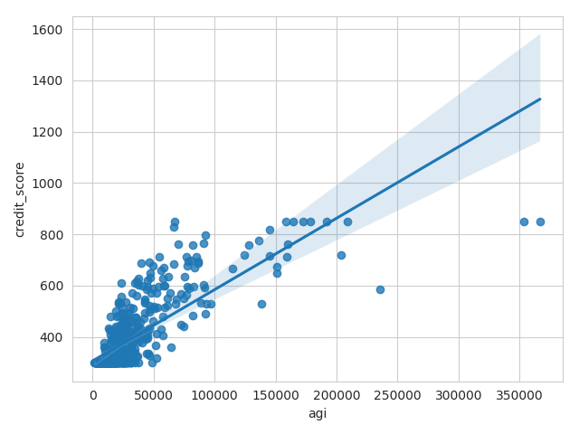

# Worked example of Secure Infrastructure for Research with Administrative Data (SIRAD)

`sirad` is an integration framework for data from administrative systems. It
deidentifies administrative data by removing and replacing personally
identifiable information (PII) with a global anonymized identifier, allowing
researchers to securely join data on an individual from multiple tables without
knowing the individual's identity.

This is a simplified demonstration of how `sirad` works on simulated data; for
more details on how it is used in practice with real administrative data,
please see our article in *Communications of the ACM*:

> J.S. Hastings, M. Howison, T. Lawless, J. Ucles, P. White. (2019).
> Unlocking Data to Improve Public Policy. *Communications of the ACM* **62**(10): 48-53.
> doi:[10.1145/3335150](https://doi.org/10.1145/3335150)

## Background

We developed SIRAD at [Research Improving People's Lives](https://ripl.org) to build a comprehensive, integrated database of administrative records in partnership with the State of Rhode Island. Although we initially investigated enterprise tools in the business intelligence space for data modeling and integration, the up-front cost of those solutions led us to instead develop a lightweight integration tool in Python using an agile approach, which became SIRAD. The core functionality of SIRAD is the ability to hash sensitive identification numbers and separate PII at load time, and we designed it around this from the start, while incorporating additional features through agile sprints. Additional features, such as the `sirad_id`, were identified, specified, and validated through a tight feedback loop between the data integration team building SIRAD and the researchers using successive versions of the RI 360 database. The rapid development of SIRAD and the RI 360 database was facilitated by housing both the data integration team and the research team in the same lab.

One of the biggest challenges with using administrative data in research is identifying the same individual across data sets while preserving the highest level of confidentiality and anonymity possible and ensuring that information about an individual cannot be viewed alongside an individual's identity. Agencies may use multiple sources of information to uniquely identify individuals in their records, and may not consistently identify individuals across records. Without a universal identifier, the task of identifying unique individuals is difficult, and joining individual-level data across agencies becomes more complex as the number of agencies and records increases. This creates several problems for research and analysis: researchers could end up spending more time identifying and joining data than actually performing analysis; that effort could be duplicated across projects; inconsistencies may arise if different projects take different approaches to joining data; and individual identities may be seen by researchers alongside data on those individuals during a matching process thus lowering the degree of anonymity provided during the database construction process. 

To address these issues, SIRAD constructs a global anonymous identifier (the `sirad_id`) that researchers can use to join information about an individual without knowing any PII for that individual. An automated script concatenates all hashed SSN, first name, last name, and date of birth (DOB) records into a single table, while maintaining an encrypted link to the source table and row for the records. If a record contains information on multiple individuals (such as a birth record that describes both the child and the parents), it is expanded into one row per individual. All names are cleaned to remove non-letter characters, and first names are converted to Soundex values.

A `sirad_id` is assigned to every valid hashed SSN, and to every distinct combination of first name Soundex, last name, and DOB that cannot be matched to a single valid hashed SSN. For example, if multiple records match on first name Soundex, last name, and DOB, but only one record has a valid hashed SSN, then all of those records will inherit the `sirad_id` corresponding to the valid hashed SSN. However, if those records instead match to several valid hashed SSNs, then a distinct `sirad_id` is assigned to each valid hashed SSN as well as to the remaining unmatched combinations of first name Soundex, last name, and DOB. Finally, records that are missing a valid hashed SSN and are also missing one of first name, last name, or DOB, are considered too ambiguous and are not assigned a `sirad_id`.

SIRAD uses a simple layout file for each incoming table to describe the metadata for each of its columns. The layout file describes the original column name, the type (e.g. date, string, or numeric), the date format (if applicable), a flag for whether a column is a sensitive numeric identifier that needs to be automatically hashed at load time, and another flag indicating whether the column contains personally identifiable information (PII) and the standardized name of the PII (such as first name, last name, or DOB). These files are version controlled in git to retain the full history of loads and transformations.

SIRAD uses an Extract Load Transform (ELT) approach. Loading the original data without applying extensive transformations has several benefits when using administrative data for research. First, it retains the provenance of data and the values in the RI 360 database can be assumed to be the original information from the administrative system, not a derivative value created by a transformation process that may not be readily available to the researcher viewing the data. Second, transformations do not need to be defined upfront, which can be both time consuming and rigid, especially as research needs can evolve and change rapidly. The data are minimally transformed and made available to researchers within a short period of time. Finally, this approach is flexible for researchers; transformations can be created, changed or dropped within the database without requiring interventions by the data integration team, or time-consuming reprocessing steps.

## Worked example

In this worked example, we simulate two administrative data sets:

**1. IRS 1040 tax returns**, identified by social security number (SSN), first/last
   name, and date of birth (DOB)  
**2. Credit history**, identified by first/last name and date of birth (DOB)

`sirad` uses a deterministic matching algorithm to match records across the two
data sets corresponding to the same individual. It then assigns an anonymized
identifier (the `sirad_id`) to each matched individual, and creates a
deidentified table for each data set where the SSNs, names, and DOBs have been
replaced with the `sirad_id`. Finally, we demonstrate an analysis that uses the
`sirad_id` to join adjusted gross income from the tax returns table to credit
scores in the credit history table.

**Note**: the data are simulated by the `simulate.py` script using
[Faker](https://github.com/joke2k/faker), which creates realistic PII that does
not represent actual individuals. Any data in this example that look
personally identifiable are not!

## Installing dependencies

Requires Python 3.7 or later.  There are several options for installing the
dependencies (list in `requirements.txt`).

You can use **pip** to install them globally with  
`pip install -r requirements.txt`.

If you do not have write access to install globally, you can install into your
home directory with  
`pip install --user -r requirements.txt`.

If you have Anaconda Python, you can use **conda** to install them in your
root environment with  
`conda create -c ripl-org --file requirements.txt`.

Or if you would prefer to create a named conda environment, use  
`conda create -c ripl-org -n sirad-example --file requirements.txt`  
and activate it with  
`conda activate sirad-example`.

## Running the example

### Step 1: Simulate data

Command: `python simulate.py`

This script uses the [Faker](https://github.com/joke2k/faker) package to
simulate raw data files, which are written to the `raw` directory. **Note**:
although the simulated files contain realistic PII, they do not represent
actual individuals.

### Step 2: Process the raw data into separate PII, data, and link files

Command: `sirad process`

`sirad` processes a set of **raw** data files specified by a set of **layout
files**. In this example, there are two simulated raw data files generated in
Step 1: tax records (`raw/tax.txt`) and credit history
(`raw/credit_scores.txt`). Their layouts are `layouts/tax.yaml` and
`layouts/credit_scores.yaml`. The layouts are YAML files that describe the
column layout and field types in the raw data files.

The processing step uses the `pii` properties in the layout to split the PII
fields from the data fields in each row of the raw files. It randomly shuffles
the order of the PII rows when writing to the PII file. The data file has the
same row order as the raw data file.  The link file provides a lookup table
that re-links the shuffled PII rows to the data rows.

The results are organized in the following directory structure:
* `build/data/Example_V1`: processed data files
* `build/pii/Example_V1`: processed PII files
* `build/link/Example_V1`: processed link files

### Step 3: Create a versioned research database

Command: `sirad research`

This step uses the PII files to construct a global anonymized identifier (the
`sirad_id`), then uses the link files to attach it to each data file.  The
result is a set of **research** files which contain no PII, but in which
individual-level data in different files can be joined by the anonymized
identifier. Research files are versioned to support reproducible analysis,
using the current version set in `sirad_config.py`. You will find two research
files in the `build/research/Example_V1` directory:

#### tax.txt

sirad_id | record_id | job | file_date | adjusted_gross_income | import_dt
-|-|-|-|-|-

#### credit_scores.txt

sirad_id | record_id | credit_score | import_dt
-|-|-|-

Notes:
* `sirad_id` is an anonymized identifier created from the PII.
* `record_id` is a primary key for the research/data records (which can be linked via the link files to the shuffled `pii_id` primary key in the PII files).
* `import_dt` is a timestamp for when the raw data were processed.
* All PII fields (SSN, first/last, DOB) have been removed from the research files.

In a real-world application, only the `build/research/Example_V1` directory
would be accessible to researchers.  The data, PII, and link directories from
the processing step above should be stored in a restricted location that is
inaccessible to any individual researcher, for example by using encryption with
a multi-party key or passphrase, auditing, real-time alerting, and/or other
appropriate security controls that ensure an individual researcher cannot
access build files that contain PII.

### Step 4: Example analysis

Command: `python scatterplot.py`

This step demonstrates an analysis that uses the `sirad_id` to
anonymously join records about individuals. It selects adjusted gross income
from the `tax` table joined to the corresponding credit score from the
`credit_scores` table, then generates this scatter plot (`scatterplot.png`):

**Note:** these variables are correlated by construction, and were drawn from a
joint distribution (with added noise) in the simulation.
